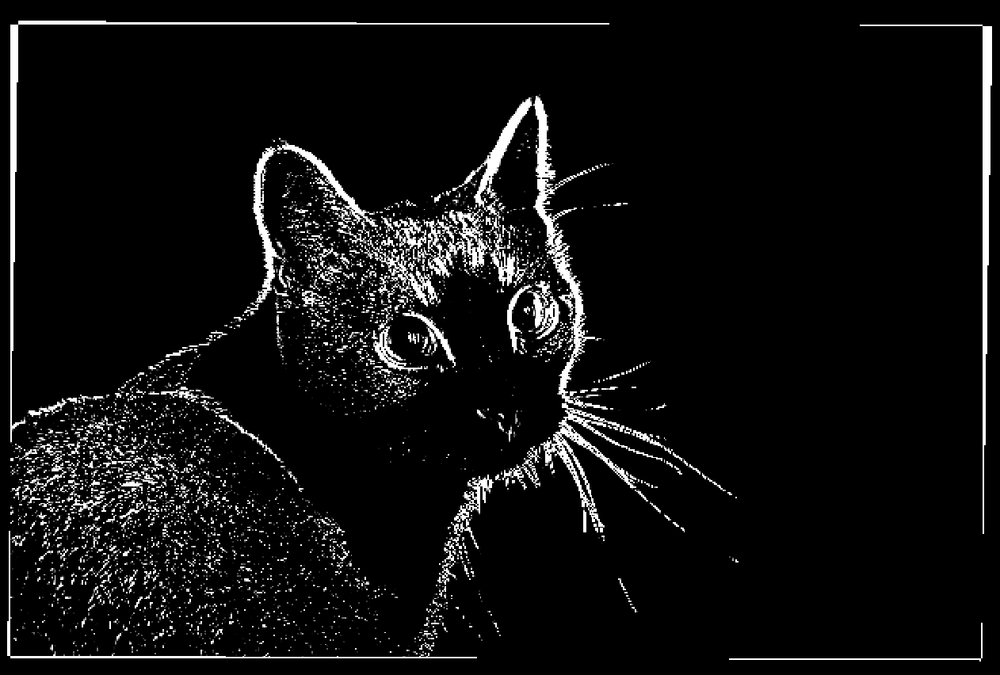
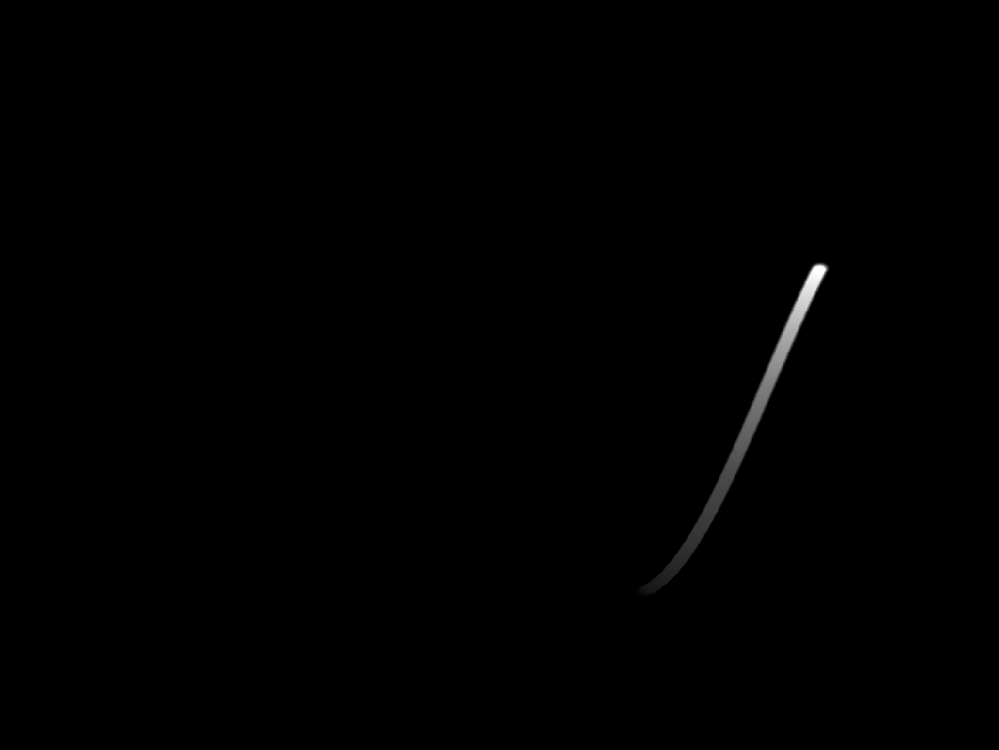
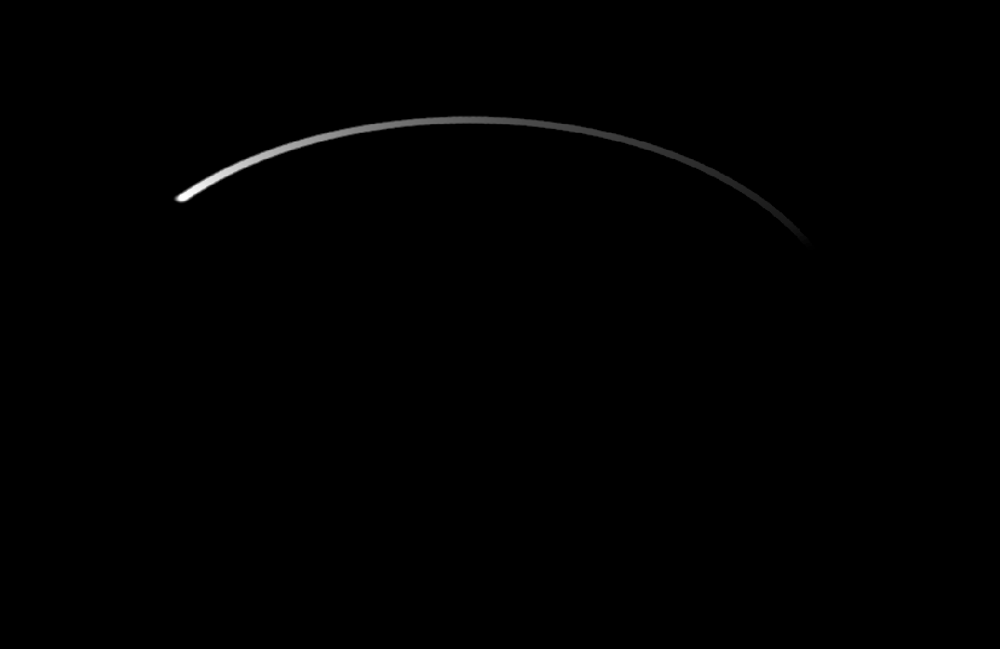
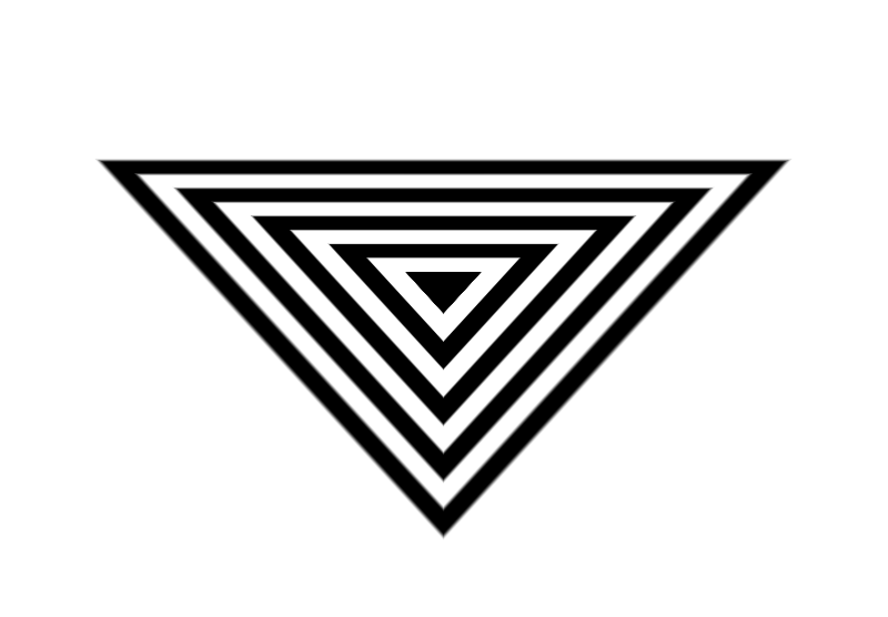

# "functions"
I've isolated a sequence of a few hydra functions which I like for convenience and gave it a name.

## edje_detector
It is not a "real" edge detector but looks like one. No sobel or other fancy things.

## plot_function
Just plot a function. The function can be changed based on preference. Here a portion of a sine wave.

## plot_parametric
Plot a parametric function. Here a circle.

## striped_shape
Create a shape with stripes of uniform size. 
