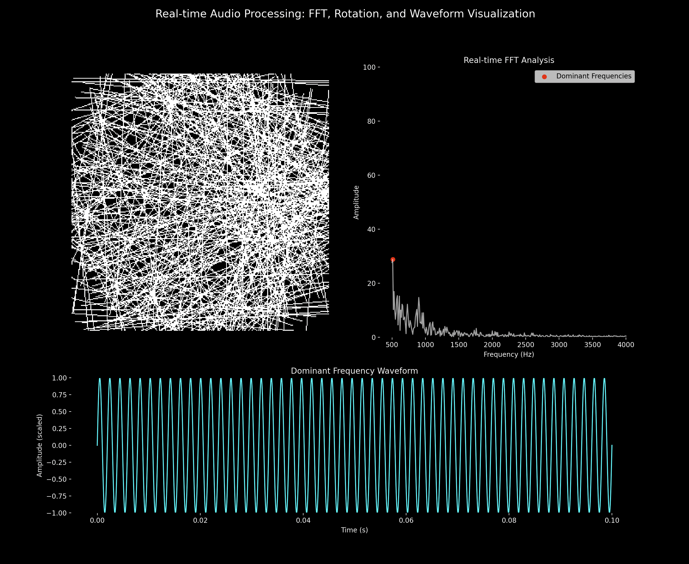

# python with or without hydra

## derotation_responsive_to_music
This script integrates the [derotation algorithm](https://github.com/neuroinformatics-unit/derotation), originally developed to correct motion artefacts in microscopy images, with real-time audio input. It uses sound captured from the microphone to dynamically control the derotation of a white square, creating an interactive audiovisual demonstration of the algorithm.

# 